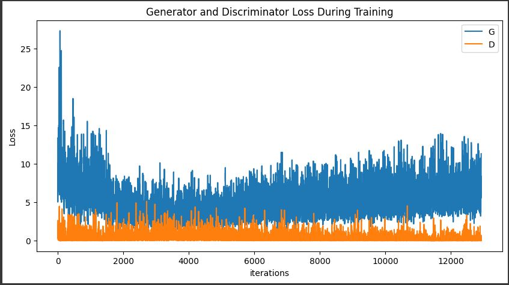
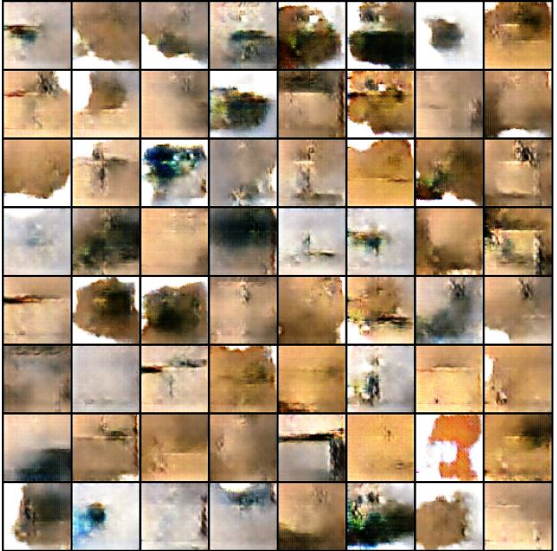

# Génération d'Images avec un Réseau Antagoniste Génératif (GAN)

Ce projet met en œuvre un Réseau Antagoniste Génératif Convolutionnel Profond (DCGAN) en utilisant PyTorch pour générer de nouvelles images synthétiques. Le modèle est entraîné à produire des images qui ressemblent à celles d'un jeu de données fourni.



## Table des Matières
- [Description](#description)
- [Prérequis](#prérequis)
- [Installation](#installation)
- [Utilisation](#utilisation)
- [Architecture du Modèle](#architecture-du-modèle)
  - [Générateur](#générateur)
  - [Discriminateur](#discriminateur)
- [Résultats](#résultats)
- [Auteur](#auteur)

## Description

Les Réseaux Antagonistes Génératifs (GANs) sont une classe de modèles d'apprentissage non supervisé où deux réseaux de neurones, le **Générateur** et le **Discriminateur**, sont mis en compétition.

-   **Le Générateur** : Crée des images à partir d'un vecteur de bruit aléatoire. Son objectif est de générer des images si réalistes qu'elles peuvent tromper le Discriminateur.
-   **Le Discriminateur** : Évalue les images pour déterminer si elles sont réelles (provenant du jeu de données d'entraînement) ou fausses (créées par le Générateur).

À travers un entraînement itératif, le Générateur apprend à produire des images de plus en plus convaincantes, tandis que le Discriminateur s'améliore dans la détection des faux.

## Prérequis

Toutes les bibliothèques Python nécessaires pour exécuter ce projet sont listées dans le fichier `requirements.txt`.

- Python 3.x
- PyTorch
- NumPy
- Matplotlib
- torchvision

## Installation

1.  **Clonez ce dépôt :**
    ```bash
    git clone https://github.com/Achraf-ABID/Nom-De-Votre-Projet.git
    cd Nom-De-Votre-Projet
    ```
    *(Remplacez `Nom-De-Votre-Projet` par le nom de votre dépôt)*

2.  **Créez un environnement virtuel (recommandé) :**
    ```bash
    python -m venv venv
    source venv/bin/activate  # Sur Windows: venv\Scripts\activate
    ```

3.  **Installez les dépendances :**
    ```bash
    pip install -r requirements.txt
    ```

## Utilisation

L'ensemble du processus, de la configuration à la visualisation des résultats, est contenu dans le notebook Jupyter `GAN.ipynb`.

1.  **Placez votre jeu de données** dans un dossier accessible. Le chemin d'accès à ce dossier doit être spécifié dans la variable `dataroot` du notebook.
2.  **Lancez Jupyter Notebook ou JupyterLab :**
    ```bash
    jupyter notebook
    ```
3.  Ouvrez `GAN.ipynb` et exécutez les cellules séquentiellement.

### Configuration

Les principaux hyperparamètres peuvent être ajustés dans la deuxième cellule du notebook :

-   `dataroot` : Chemin vers le dossier racine des images d'entraînement.
-   `batch_size` : Taille du lot pour l'entraînement (par défaut : 8).
-   `image_size` : Taille des images (par défaut : 64x64).
-   `nz` : Taille du vecteur latent d'entrée `z` (par défaut : 100).
-   `num_epochs` : Nombre d'époques d'entraînement (par défaut : 128).
-   `lr` : Taux d'apprentissage (par défaut : 0.00025).
-   `beta1` : Paramètre Beta1 pour l'optimiseur Adam (par défaut : 0.8).

## Architecture du Modèle

### Générateur

Le générateur prend un vecteur de bruit de dimension `nz` et le transforme en une image de `64x64x3` à travers une série de couches de convolution transposée (`ConvTranspose2d`), chacune suivie d'une normalisation par lots (`BatchNorm2d`) et d'une fonction d'activation ReLU. La couche finale utilise une fonction d'activation Tanh pour normaliser les pixels de l'image de sortie entre -1 et 1.

### Discriminateur

Le discriminateur est un classifieur binaire qui prend en entrée une image de `64x64x3`. Il utilise une séquence de couches de convolution (`Conv2d`) avec des fonctions d'activation LeakyReLU pour extraire les caractéristiques de l'image. La couche finale utilise une fonction Sigmoid pour produire une probabilité indiquant si l'image est considérée comme réelle ou fausse.

## Résultats

Après 128 époques d'entraînement, le générateur est capable de produire les images suivantes à partir de vecteurs de bruit aléatoires.

### Image Générée


### Évolution de la Perte (Loss)
Le graphique ci-dessous montre la progression des fonctions de perte du Générateur (G) et du Discriminateur (D) au fil des itérations. Une convergence stable indique un bon équilibre dans l'entraînement.

*(L'image du graphique de perte est générée à la fin de l'exécution du notebook `GAN.ipynb`)*

## Auteur

- **Achraf ABID** - [Achraf-ABID](https://github.com/Achraf-ABID)
